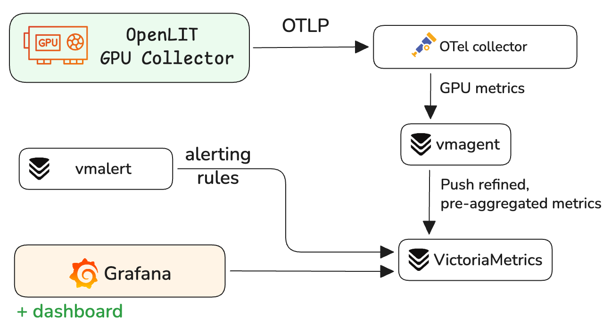
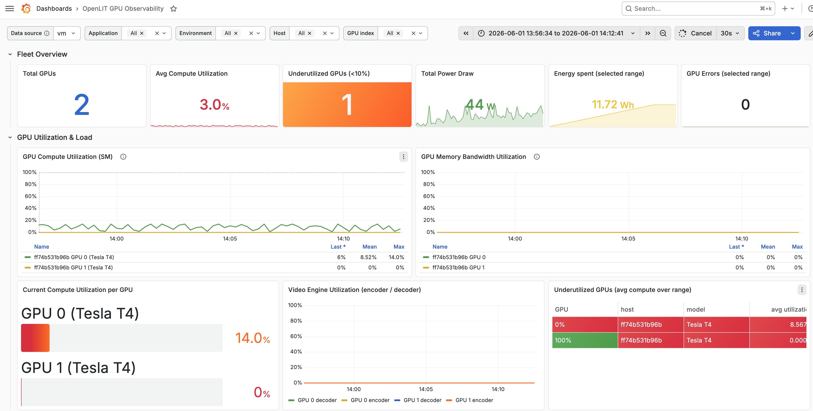
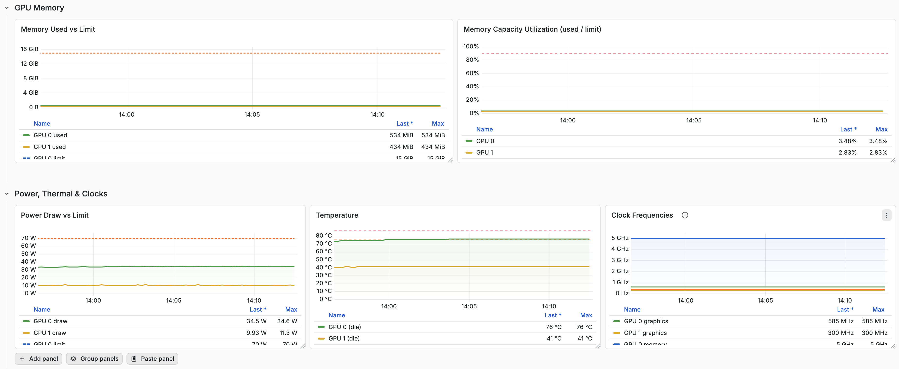
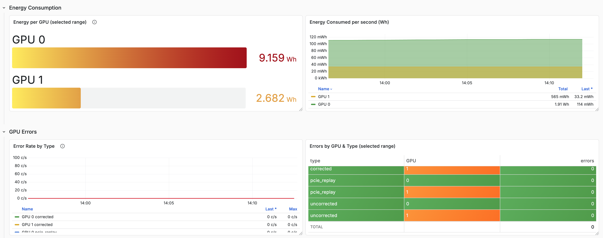
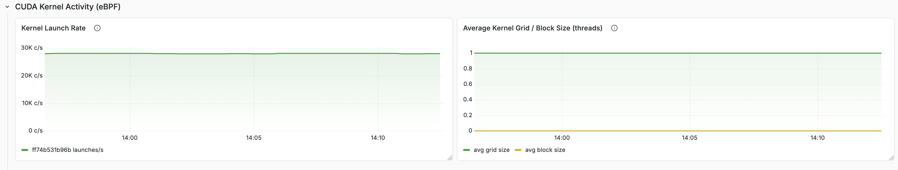
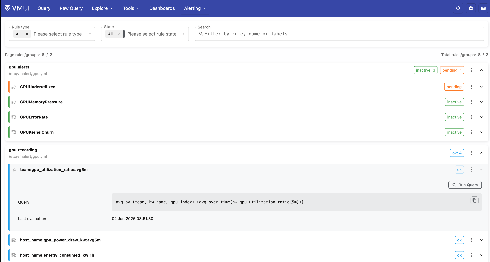

# GPU Observability

This is a demo project to demonstrate how to monitor GPUs by emitting metrics via [Openlit OpenTelemetry GPU Collector](https://github.com/openlit/openlit/tree/main/opentelemetry-gpu-collector)
and [VictoriaMetrics](https://docs.victoriametrics.com/victoriametrics/).

See also a [demo project for AI observability](https://github.com/VictoriaMetrics/ai-observability).

## Architecture

The demo consists of the following components:



1. [Openlit OpenTelemetry GPU Collector](https://github.com/openlit/openlit/tree/main/opentelemetry-gpu-collector) installed
  on an instance with [Nvidia GPU, CUDA and eBPF kernel support](https://github.com/openlit/openlit/tree/main/opentelemetry-gpu-collector#prerequisites).
2. OpenTelemetry collector receives metrics from the GPU Collector and emits them to [vmagent](https://docs.victoriametrics.com/victoriametrics/vmagent/).
3. vmagent performs [stream aggregation](https://docs.victoriametrics.com/victoriametrics/stream-aggregation/) to strip 
   too expensive dimensions and send the data to VictoriaMetrics. **This step is optional**: if stream aggregation is not needed, 
   OTEL collector can write directly to VictoriaMetrics.
4. VictoriaMetrics receives metrics from vmagent and stores them in the database.
5. Grafana provisioned with:
   - [datasource for metrics](https://github.com/VictoriaMetrics/gpu-observability/tree/main/provisioning/datasources)
   - [dashboard for GPU observability](https://github.com/VictoriaMetrics/gpu-observability/blob/main/provisioning/dashboards/openlit-demo.json)
6. vmalert for running basic [alerting and recording rules](https://github.com/VictoriaMetrics/gpu-observability/blob/main/rules/gpu.yml) against VictoriaMetrics.

See the [compose.yml](https://github.com/VictoriaMetrics/gpu-observability/blob/main/compose.yml) for the full list of services.

## Quickstart

> Make sure that on the instance where you run it on an instance with Linux and NVIDIA/AMD/Intel GPU drivers installed.

Clone this repository:
```sh
git clone https://github.com/VictoriaMetrics/gpu-observability
cd gpu-observability
```

Start the observability stack via docker-compose:
```sh
docker compose up -d
```

The docker-compose spins up the exporter and the observability stack:
1. VictoriaMetrics available at http://localhost:8428/
4. Grafana available at http://localhost:3000/ (admin:admin)

> Please verify you have mentioned HTTP ports opened locally when running docker-compose.

> For some telemetry signals to be emitted, the GPU device must actually perform some work.

After a few minutes the application was running, it should have emitted telemetry to VictoriaMetrics.
Open the Grafana and navigate to the [provisioned dashboard](https://github.com/VictoriaMetrics/gpu-observability/blob/main/provisioning/dashboards/openlit-demo.json):








Check the alerting and recording rules by visiting [Alerting page](http://localhost:8428/vmui/?#/rules):
